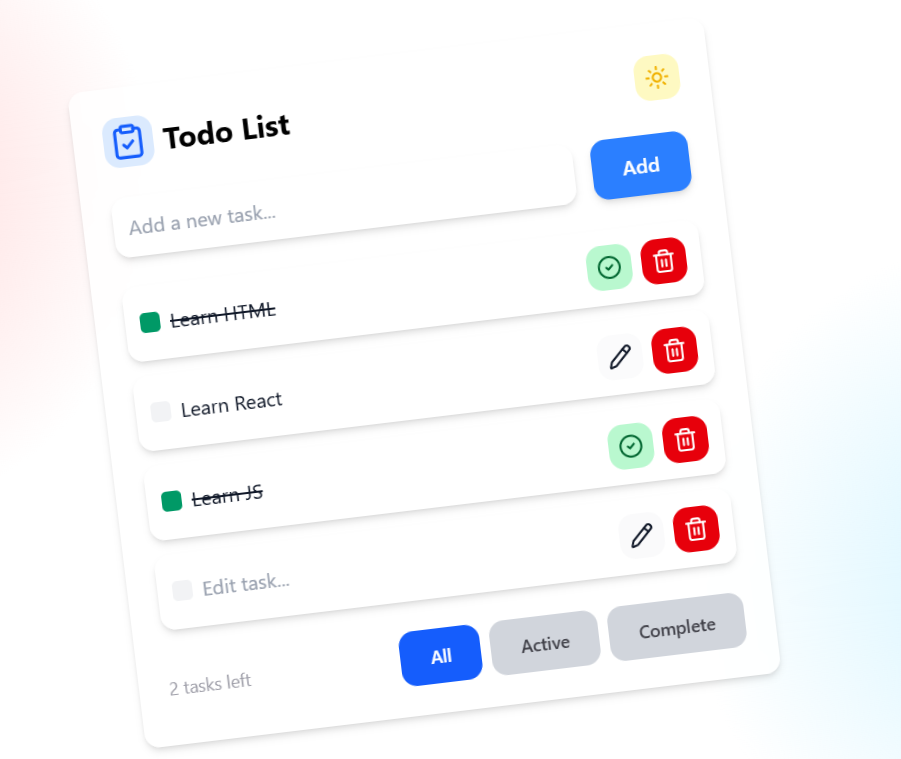
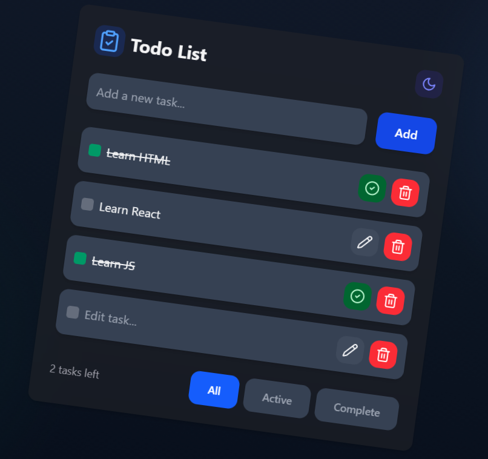

# 📝 Modern Todo Application

A sleek, functional, and animated Todo List application built with **React**, **Vite**, and **Tailwind CSS**. This project demonstrates core React principles such as state lifting, conditional rendering, and component-based architecture.

## ✨ Features

- **Complete CRUD**: Create, Read, Update, and Delete tasks with ease.
- **Persistent Storage**: Tasks are saved in **Json-Server** to ensure data persists after page refreshes. And Theme Saved in **LocalStorage**
- **Smart Filtering**: Toggle between **All**, **Active**, and **Completed** tasks seamlessly.
- **Smooth Animations**: Enhanced user experience using **Framer Motion** for list transitions.
- **Dark Mode Support**: Fully responsive design with a beautiful Dark/Light theme toggle.
- **In-place Editing**: click the edit icon to modify tasks directly in the list.

## 🛠️ Tech Stack

- **Frontend**: React.js (Hooks: `useState`, `useEffect`, `useRef`, `useMemo`)
- **Styling**: Tailwind CSS
- **Animations**: Framer Motion
- **Build Tool**: Vite
- **React Libraries**: `React-Loader-Spinner` - `React-Hot-Toast` - `Axios` - `React-Icons`

## 🧠 Technical Highlights

In this project, I focused on implementing best practices for a Junior React Developer:

1.  **Lifting State Up**: Managed the filtering logic in the parent component (`App.jsx`) and synchronized it with the `Footer` and `TodoList` components.
2.  **State Synchronization**: Used `useEffect` to keep the LocalStorage in sync with the application state.
3.  **Ref Management**: Utilized `useRef` for auto-focusing the input field during task adding to improve UX.
4.  **Optimized Rendering**: Implemented conditional class rendering for active states and task completion.

## 📸 Screenshots

| Light Mode                                  | Dark Mode                                 |
| ------------------------------------------- | ----------------------------------------- |
|  |  |

## 🚀 Getting Started

1. **Clone the repo**
   ```bash
   git clone [https://github.com/DarkestGhost/react-todolist.git](https://github.com/DarkestGhost/react-todolist.git)
   ```
2. **Install dependencies**
   npm install

3. **Run the server**
   npm run server

4. **Run the project**
   npm run dev
